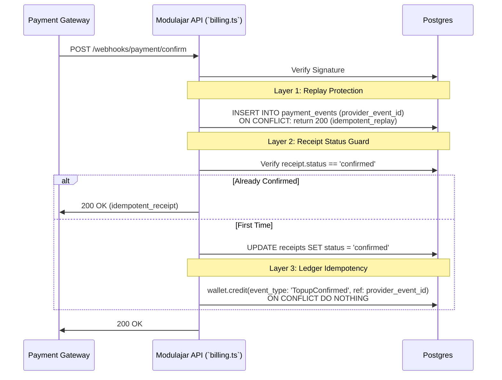

# Billing Contract — Canon 04

The ModulAjar billing system is formalized as a strict append-only ledger to prevent state drift, eliminate double-counting, and ensure consistent credit accounting across the API and worker layers.

## Ledger Invariants

The `wallet_ledger` table is the single source of truth for a workspace's balance.

1. **Append-Only**: No `UPDATE` or `DELETE` operations are ever allowed on `wallet_ledger`.
2. **Immutability**: The balance is never stored as a mutable column. It is always calculated dynamically.
3. **Derived Balance Formula**:
   $$ Balance = \sum(credits) - \sum(debits) $$
4. **Idempotency**: Every ledger entry must have a unique `(workspace_id, reference_id, type)` constraint. Any duplicate inserts are safely ignored (`ON CONFLICT DO NOTHING`).
5. **Traceability**: Every ledger entry MUST include a valid `event_type` in its `metadata` JSON.

## Canonical Event Types

Only the following string literals are permitted for the `event_type` metadata field:

| Event Type | Ledger `type` | Description | `reference_id` Pattern |
| :--- | :--- | :--- | :--- |
| `TopupConfirmed` | `credit` | User successfully paid for a top-up via payment gateway webhook. | Provider Event ID (e.g., webhook ID) |
| `GenerationUsageDebit` | `debit` | User enqueued a Generation Job (pre-paid). | Job ID |
| `ReferralReward` | `credit` | User earned credits organically from referrals. | Job ID |
| `RefundCredit` | `credit` | (Optional) Refund issued for extreme failures. | Job ID |

## Top-Up Webhook Sequence

To prevent double-crediting from webhook retries (replay attacks), the Top-Up flow traverses two idempotency layers:

## Debit Determinism

Debits for generation jobs must occur **deterministically in a single location** before the job enters the work queue.
- **Location**: `api-ts/src/routes/modules.ts`
- **Method**: Atomic CTE inside the `wallet.debit` function.
- **Failure**: If `wallet.debit` throws "Insufficient balance", the API must instantly return an HTTP 402, and the job must NEVER be enqueued.
