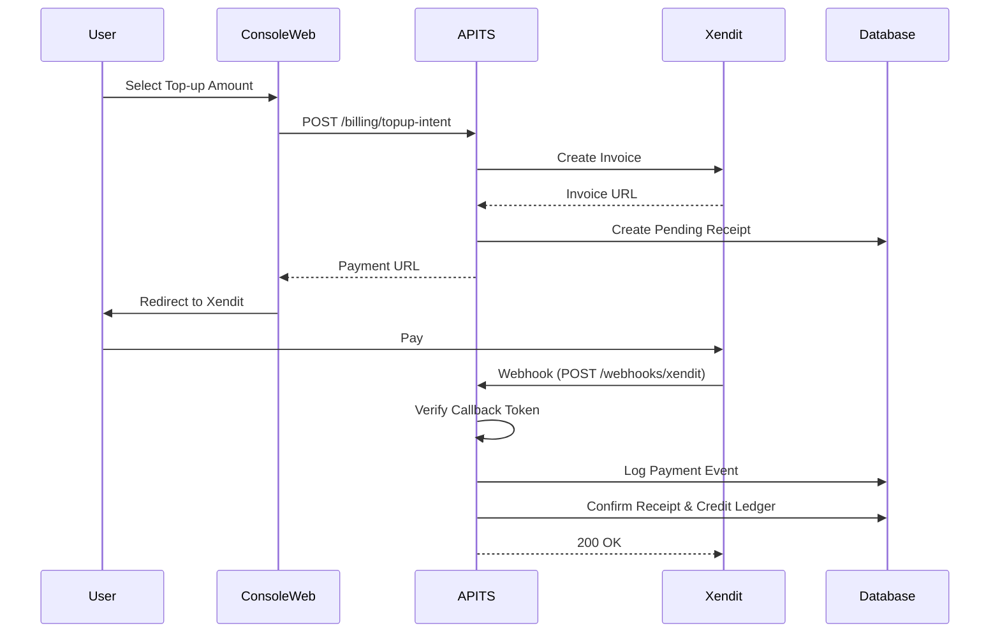

# Documentation: Payment Rail (Xendit + Voucher System)

This document outlines the architecture and implementation of the payment rail in Modulajar, supporting Xendit top-ups and voucher redemption.

## High-Level Architecture

The payment rail is built on top of an **append-only ledger** system. Credits are never directly modified; instead, they are provisioned through verified **Receipts**, which then create **Wallet Ledger** entries.

### Payment Entities
- **Receipts**: The source of truth for a payment intent. Status moves from `pending` -> `confirmed`.
- **payment_events**: Tracks incoming webhooks for replay protection and auditing.
- **voucher_codes**: Stores pre-generated codes for credit redemption.
- **wallet_ledger**: The final destination for all credit/debit operations.

---

## 1. Xendit Top-Up Flow

Modulajar uses Xendit Invoices for a seamless top-up experience.

### Sequence Diagram

### Webhook Verification
Verification is performed using a static `XENDIT_CALLBACK_TOKEN` compared against the `x-callback-token` header using constant-time comparison to prevent timing attacks.

---

## 2. Voucher System

Vouchers allow for offline distribution and reseller channels.

### Voucher Lifecycle
1. **Generation**: Admin generates codes (e.g. `VA-A1B2-C3D4`) with specific credits.
2. **Active**: Voucher is ready to be redeemed.
3. **Redemption**: 
   - User enters code.
   - System performs atomic `SELECT ... FOR UPDATE` to prevent race conditions.
   - Receipt created with method `voucher`.
   - Credits appended to wallet ledger.
   - Voucher marked as `redeemed`.

---

## 3. Ledger Integrity

All transactions involve a unique `reference_id` in the `wallet_ledger` to ensure idempotency:
- **Xendit**: `reference_id` = Xendit Invoice ID.
- **Voucher**: `reference_id` = Voucher Code.

This prevents the same payment or voucher from being credited multiple times.

## 4. Security Model
- **Idempotency**: Forced by unique constraints on `payment_events(provider_event_id)` and `wallet_ledger(workspace_id, reference_id, type)`.
- **Atomicity**: DB Transactions (BEGIN/COMMIT) used for all state transitions involving credits.
- **Auditability**: `payload_hash` stored for all webhooks, `ledger_id` stored on receipts.
